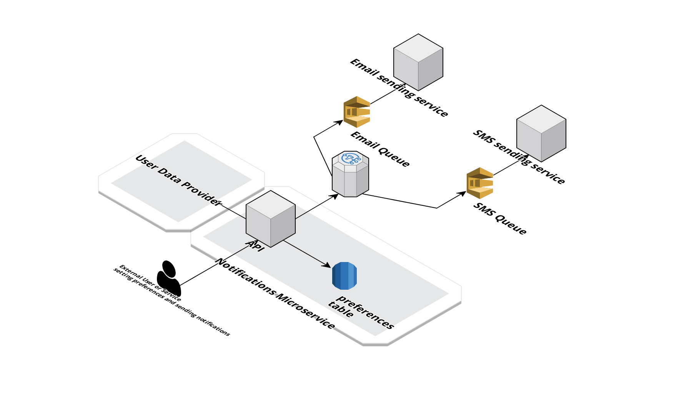

# walker_dunlop_challenge <!-- omit from toc -->
Challenge for Walker &amp; Dunlop interview process

# Content <!-- omit from toc -->
- [Architecture](#architecture)
- [Architecture decisions](#architecture-decisions)
- [Assumptions](#assumptions)
- [Known limitations](#known-limitations)
- [Areas for improvement](#areas-for-improvement)
- [Setup](#setup)
    - [Prerequisites](#prerequisites)
    - [Install dependencies](#install-dependencies)
    - [Start the service](#start-the-service)
- [Unit tests](#unit-tests)
    - [Install Pytest](#install-pytest)
    - [Run the unit tests](#run-the-unit-tests)
- [API docs](#api-docs)

# Architecture

The architecture relies on the fan-out pattern. This allows publishing a message to an SNS Topic with multiple SQS Subscriptions.
Each SQS Subscription has it's own Subscription filter policy so it only consumes the messages concerning to that particular SQS Queue. This mechanism makes possible to, by just publishing a single message to the SNS Topic, have multiple Queues consuming those messages and only processing those that are of interest to each of those Queues.

An example of a Subscription filter policy for Users with Email enabled would be:
 ```json
{
  "email": [
    {
      "exists": true
    }
  ]
}
```
And similarly to filter the notifications for Users with SMS enabled:
 ```json
{
  "phone": [
    {
      "exists": true
    }
  ]
}
```
The above filter will take only the messages that are supposed to be sent by Email to the Users.

# Architecture decisions
- FastAPI was the chosen framework for its improved performance, built-in validation features and the automatic generation of API documentation.
- For simplicity, AWS SNS and SQS services were used as the event and queuing services.

# Assumptions
- An external Database or API provides the User data, like Email or Phone. For the sake of simplicity, a User table was created to provide this data.
- The external source of User's data provides a unique id to identify each user. In this service a user_id is used to match the User's data with the User's preferences.
- The implementation of the code that sends the Email or SMS notifications is out of scope.

# Known limitations
- The /notifications/ endpoint only supports sending a message payload. Other useful fields like Subject were not considered.
- The /notifications/ endpoint doesn't allow for filtering users by criteria other than email or sms enabled. It is not possible to send notification to a subset of users.
- There's no way to know if a notification was successfully delivered to each user. 

# Areas for improvement
- Exception handling
- Define a logging strategy and an appropriate logging library
- Implement authentication and authorization for the API endpoints. Potentially use RBAC to control which clients can access the /preferences/ endpoints and the /notifications/ endpoint.
- Run performance tests to validate the /notifications/ endpoint behavior. What happens when sending a notification to thousands of users? Or even millions of users?

# Setup
### Prerequisites
- A PostgreSQL instance running on an accessible location

### Install dependencies
```console
$ pip install -r requirements.txt
```

### Start the service
```console
$ uvicorn src.main:app
```
This will start the service on http://127.0.0.1:8000

# Unit tests
### Install Pytest
```console
$ pip install pytest
```

### Run the unit tests
```console
$ pytest
```

# API docs
- Swagger: http://127.0.0.1:8000/docs
- ReDoc: http://127.0.0.1:8000/redoc
